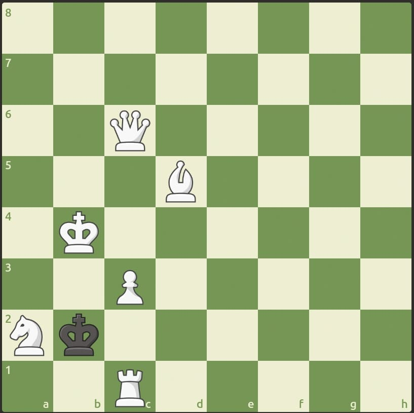

# Stego Gambit

Do you dare to accept the Stego Gambit? I know you can find the checkmate but the flag!!



## Solution

We are provided with a picture file. This picture describes a chess position, in which black seems heavily at a disadvantage.

The challenge is called Stego Gambit. Stego makes us think that there will be steganography in this challenge.

A gambit is a chess opening in which a player risks one or more pawns or a minor piece to gain an advantage in position. Usually it involves an element of surprise, something unexpected or difficult to see.

### Steganalysis of the picture

The picture provided is a JPEG. In terms of steganalysis, this heavily reduces the chances that bit fields will be of interest.

#### Static analysis

Steganography is sometimes as simple as opening a file in a text editor and observing that text data isn't written somewhere in it.

Doing it manually is rather uninteresting, so automation / commands may be used.

```bash
file chall.jpg
# chall.jpg: JPEG image data, JFIF standard 1.01, aspect ratio, density 1x1, segment length 16, comment: "Use the moves as a key to the flag, separated by _", baseline, precision 8, 817x815, components 3
# This is a valid JPEG
strings chall.jpg > strings.txt
# JFIF
# 4Use the moves as a key to the flag, separated by _
# ... more data
```

Using `strings` on the file reveals something interesting:

> Use the moves as a key to the flag, separated by _

As of right now, this gives us no clue, but it will certainly be useful later.

#### Detection of `steghide`

However, JPEG is a format that may embed steganographic data. The most common steganography tool for JPEG pictures is [Steghide](https://github.com/StegHigh/steghide). Detection of steghide may be done using a tool called [Stegseek](https://github.com/RickdeJager/stegseek).

Here's how to detect the presence of steganographic data embedded using `steghide`; using `stegseek`:

```bash
stegseek --seed chall.jpg
# The program computes for a few seconds, then gives us this output
[i] Found (possible) seed: "88cf5a2b"             
 Plain size: 61.0 Byte(s) (compressed)
 Encryption Algorithm: rijndael-128
 Encryption Mode:      cbc
```

The presence of a possible seed heavily hints that steganographic data (hidden using steghide) is embedded in this file.

### Exploitation

#### Password protection

Steghide allows the encryption of the message to evade detection.

Trying to extract the data with an empty password gave us nothing:

```bash
steghide extract --stegofile chall.jpg
# Enter passphrase: # no password
# steghide: could not extract any data with that passphrase!
```

But by tying the previous hints, it's easy to guess where the challenge is going: We're going to have to find the correct sequence of moves that leads to checkmate.

#### Analyzing the position

Since no more data is found, we have to analyze the position, by considering the direction of the board (using the rows and columns). No information on whether the turn is black's or white's.

Deduction is simple enough. Black can make no move whatsoever. If it is Black's turn in this position, the game is a stalemate (because black can make no legal move). Had the board been flipped (the rows reversed), the position would be a checkmate, because the c3 pawn (would be the c6 pawn) would check the black King.

Conclusion: it is white's turn.

White has no mate in 1, no move would checkmate Black's king (any rook move checking the king would end up losing the piece). Even though sacrificing the rook and playing further moves would inevitably end up in a checkmate, a mate sequence may be found.

The move `Bh1!` (read Bishop to `h1`) sacrifices white's Knight and leaves the room for the Queen to check on `g2` (and mate) Black's King next turn.

So, the winning sequence for White is the following:

```text
1. Bh1 Kxa2 2. Qg2#
```

#### Defeating the password protection

Now all that is left to do is to extract the data, by combining all the intel that we have got.

```text
1. Bh1 Kxa2 2. Qg2#
```

> Use the moves as a key to the flag, separated by _

Which gives us:

```text
1. Bh1 Kxa2_2. Qg2#
OR
Bh1_Kxa2_Qg2#
```

Sadly, none of these passwords gave us the data we were looking for:

```bash
steghide extract --stegofile chall.jpg
# Enter passphrase: # 1. Bh1 Kxa2_2. Qg2#
# steghide: could not extract any data with that passphrase!
steghide extract --stegofile chall.jpg
# Enter passphrase: # Bh1_Kxa2_Qg2#
# steghide: could not extract any data with that passphrase!
```

... which is odd. I manually tried various combinations, such as removing the pieces: `h1_xa2_g2#`, the `x` (which means that the move captures a piece): `Bh1_Ka2_Qg2#`... But with no luck.

#### Desperate times call for desperate measures: `hashcat` to the rescue

What better than a good ol' fashioned brute-force attack to flag steganography challenges?

Being desperate as I was, I decided to generate a candidate password list to brute-force the `steghide` password protection.

##### Generating password candidates

Using the passwords attempted in the previous step, I generated [this file](./wordlist.txt).

I generated more candidates, using a common rulelist, and `hashcat` in `stdout` mode:

```bash
hashcat -r /opt/SecLists/Passwords/password-cracking-rules/best64.rule --stdout wordlist.txt > candidates.txt
```

Finally, stegseek's brute-forcing options yield us the correct password:

```bash
stegseek chall.jpg -wl candidates.txt
# [i] Found passphrase: "Bh1Kxa2_Qg2#"
# [i] Original filename: "flag.txt".
# [i] Extracting to "chall.jpg.out".
```

It seems the creator of the challenge had forgotten to separate white and black's moves with a `_`, as the string suggested; or considered different players to play a *same move*..?

## Flag

`KashiCTF{573g0_g4m617_4cc3p73d}`
