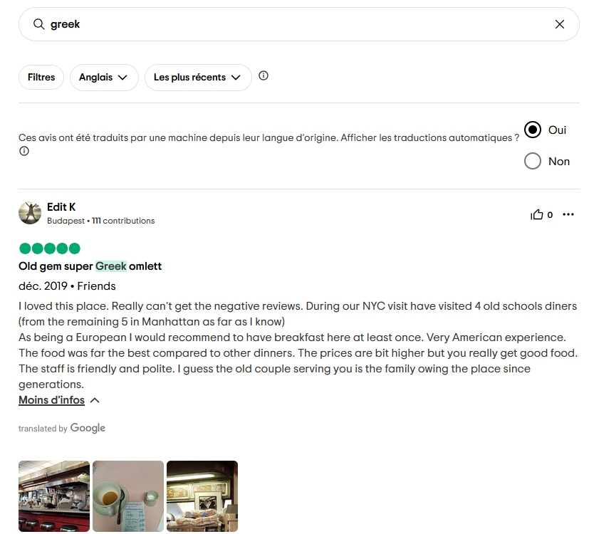

# KashiCTF - OSINT - Old Diner

This write-up sums up how I solved the OSINT challenge named Old Diner, during KashiCTF 2025.

# Challenge Description

```txt
My friend once visited this place that served ice cream with coke. He said he had the best Greek omlette of his life and called it a very american experience. Can you find the name of the diner and the amount he paid?

Flag Format: KashiCTF{Name_of_Diner_Amount}

For clarification on the flag format The diner's name is in title case with spaces replaced by underscores. The amount is without currency sign, and in decimal, correct to two decimal places, i.e. KashiCTF{Full_Diner_Name_XX.XX}

```

# Given informations

Given the challenge's description and title, we know that :

* The restaurant is an old institution
* The restaurant is known for its famous float coke (coke with ice cream)
* The restaurant is serving Greek Omelette
* The challmaker's friend liked the Greek Omelette
* The challmaker's friend said it was a very american experience
* The restaurant is located in United States (very american experience)

# Challenge solving

My first attempt was to Google for every US diner that :
* Looked very old
* Had float coke and greek omelette on the menu

I quickly realized that there were MANY MANY restaurants matching these criteria...

After re-reading the challenge description, I chose another approach. 
I searched for restaurant that served float coke, then I remembered this viral video showing a restaurant serving ice cream and coke, in the traditional american way : https://youtube.com/shorts/ixkkE8u4UxU?si=asn2yxQjlgH2WBpS

I quickly found the restaurant's name : **Lexington Candy Shop**.

After that, it seemed logical that the challmaker's friend left a review, either on Google, TripAdvisor or Yelp.

Because Google has a shitty reviews search engine, I began with TripAdvisor.
I set the appropriate filters and did a quick search with "greek" as a keyword :



A bill is attached to this TripAdvisor review where we can find the amount paid by the challmaker's frien, with an amount of **41.65U$D** : 


We then concatenate every information to get the flag :
**KashiCTF{Lexington_Candy_Shop_41.65}**

Congratz !

cptrskv
