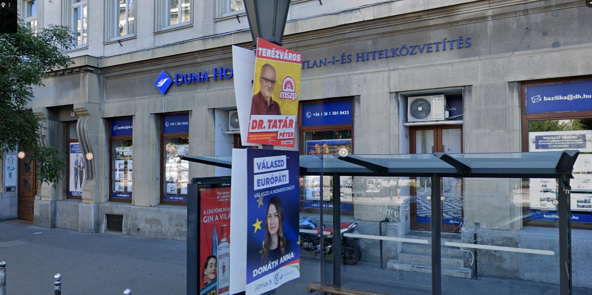
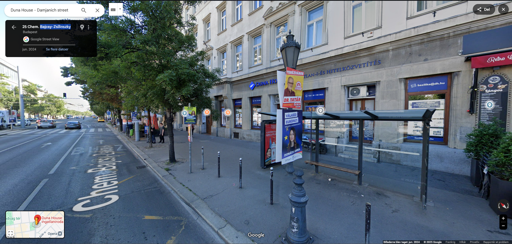

# Who Am I ??

You've stumbled upon a bustling street with political posters. Find out after which politician this road is named.

In the picture we can see a logo that is hidden by the poster of Dr.Tatar, but we can recognise the first part of the logo of Duna Hotel franchise.

However we find more then 20 of them, so, to adjust my research I added in google maps bazilika that is mentioned in the email address shown.

And when we go in google street view :

Tada we found the where the picture was taken, now we just need the name of the person witch is Bajcsy-Zsilinszky also know as Endre Bajcsy-Zsilinszky.

## Flag

`KashiCTF{Endre_Bajcsy_Zsilinszky}`
