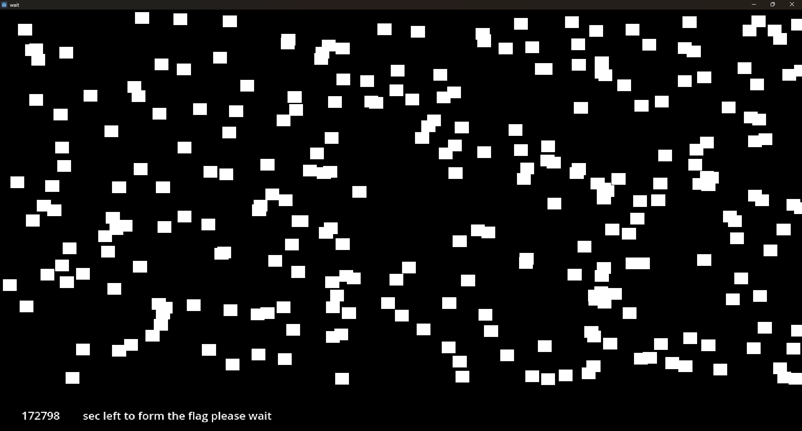
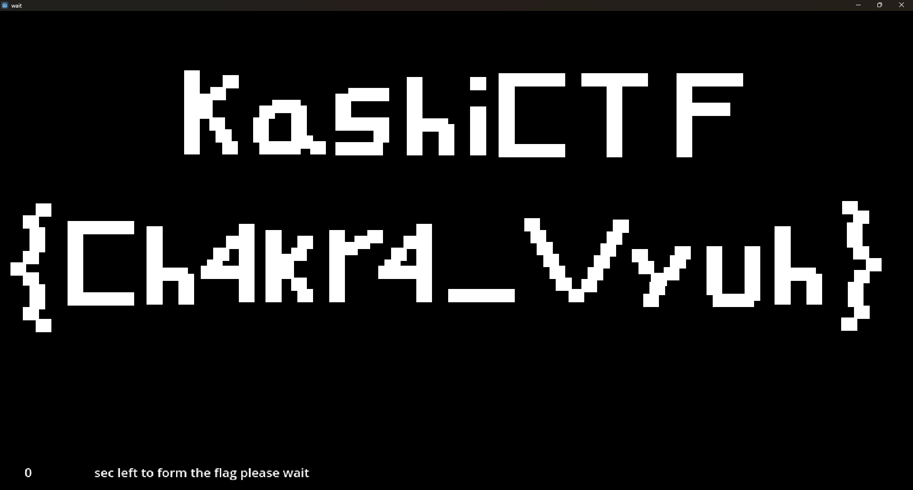

# Game 2 - Wait

Here we are given a .exe game with a Timer.

We see a number of seconds before the program with reveal us the flag, so we can speed up the process by changing our computer clock to 2050.

## Flag

`KashiCTF{Ch4kr4_Vyuh}`
